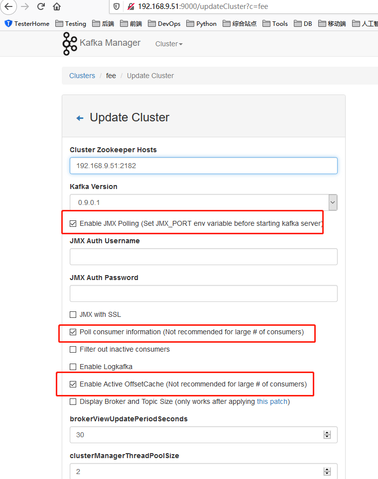

# CentOS 7 Notes
- [系统安装参考](https://blog.csdn.net/qq_39135287/article/details/83993574)
## 目录介绍
1. 软件源码包下载目录: /usr/local/src
2. 软件安装目录：/usr/local
3. 
## 常用命令
1. 配置yum下载源：https://developer.aliyun.com/article/704987 

2. 查看系统版本：cat /etc/redhat-release 

3. 下载命令:wget http://xxxx.tar.gz  或者 curl -O http://xxx.tar.gz

4. 安装软件：yum install 软件名称

5. 后台运行程序：nohup java -jar XXX.jar >>Log.log 2>&1 &

6. 文件传输工具：yum install lrzsz

7. 测试端口是否通:nc 192.168.163.41 3306

8. 远程拷贝：scp -r /home/administrator/test/ root@192.168.1.100:/root/

9. 查看端口被那个程序占用: netstat -lnp|grep 8081

10.  解压缩文件到指定目录：tar -xzvf /opt/test.tgz -C /usr/local/

11.  修改主机名称：hostnamectl set-hostname myCentos

12. curl命令：用于模拟http请求

    ```shell
    # 下载文件,支持断点续传
    > curl -C -O http://www.baidu.com
    
    ```

    

## 快捷键
1. Ctrl + Alt + 方向键取消方法
```
gsettings set org.gnome.desktop.wm.keybindings switch-to-workspace-left "[]"
gsettings set org.gnome.desktop.wm.keybindings switch-to-workspace-right "[]"
```
2. idea中默认安装完是centos的快捷键配置，可以修改为windows方式。setting-keymap.

## 安装软件
### JDK 1.8 install
1. 参考文档：https://www.cnblogs.com/sxdcgaq8080/p/7492426.html
2. 安装命令
```shell
yum update wget
cd /usr/local/src
wget 自己拷贝地址Linux x64 Compressed Archive  jdk-8u271-linux-x64.tar.gz
cd /usr/local
mkdir java
cp jdk文件 /usr/local/java
cd /usr/local/java
tar -zxvf jdk-8u144-linux-x64.tar.gz
```
3. 配置环境变量
1. vim /etc/profile
2. 在文件的最末尾添加如下内容
```
# java environment
export JAVA_HOME=/usr/local/java/jdk1.8.0_271
export CLASSPATH=.:${JAVA_HOME}/jre/lib/rt.jar:${JAVA_HOME}/lib/dt.jar:${JAVA_HOME}/lib/tools.jar
export PATH=$PATH:${JAVA_HOME}/bin
```
3.使刚刚配置的环境变量生效: source /etc/profile
4. 验证是否安装成功：java -version

### Maven 3.6.3 install
- [参考](https://www.cnblogs.com/116970u/p/11211963.html)
1. 下载安装.
```
cd /usr/local/src/
wget https://mirrors.tuna.tsinghua.edu.cn/apache/maven/maven-3/3.6.3/binaries/apache-maven-3.6.3-bin.tar.gz
cd /usr/local
mkdir maven
scp /usr/local/src /usr/local/maven
cd /usr/local/maven
tar -xzvf apache-maven-3.6.3-bin.tar.gz
```
2. 配置环境变量
1. vim /etc/profile
2. 在文件的最末尾添加如下内容
```
# maven eviroment
MAVEN_HOME=/usr/local/maven/apache-maven-3.6.3
export PATH=${MAVEN_HOME}/bin:${PATH}
```
5.  使刚刚配置的环境变量生效: source /etc/profile

6.  验证是否安装成功：mvn –v

7.  如果出现 "JAVA_HOME environment variable is not defined correctly",则可能因为电脑安装的时jre而不是jdk导致的。

```shell
    [root@localhost apache-maven-3.6.3]# source /etc/profile
    [root@localhost apache-maven-3.6.3]# mvn -v
    The JAVA_HOME environment variable is not defined correctly
    This environment variable is needed to run this program
    NB: JAVA_HOME should point to a JDK not a JRE    
```

​    

### Zookeeper and KafKa install
- [参考文档](https://www.w3cschool.cn/apache_kafka/apache_kafka_installation_steps.html)
1. 下载安装Zookeeper。注意要下载-bin.tar.gz版本的
```
cd /usr/local/src
wget https://mirrors.bfsu.edu.cn/apache/zookeeper/zookeeper-3.6.2/apache-zookeeper-3.6.2-bin.tar.gz
cd /usr/local
mkdir zookeeper
tar -xzvf /usr/local/src/apache-zookeeper-3.6.2-bin.tar.gz -C /usr/local/zookeeper/
cd /usr/local/zookeeper/apache-zookeeper-3.6.2-bin
mkdir data
```
2. 创建配置文件
```
cd /usr/local/zookeeper/apache-zookeeper-3.6.2-bin
vi conf/zoo.cfg
tickTime=2000
dataDir=/usr/local/zookeeper/apache-zookeeper-3.6.2-bin/data
clientPort=2181
initLimit=5
syncLimit=2

```
3. 启动ZooKeeper服务器：bin/zkServer.sh start
- 执行此命令后，您将得到如下所示的响应
```
$ JMX enabled by default
$ Using config: /Users/../zookeeper-3.4.6/bin/../conf/zoo.cfg
$ Starting zookeeper ... STARTED
```
4. 查看服务是否启动成功：

    ```shell
    sudo netstat -anp | grep 2181
    sh bin/zkServer.sh status
    ```

    >   如果报错：Client port found: 2181. Client address: localhost. Client SSL: false.可能是由于本机8080端口被占用。可以修改zoo.cfg文件添加未被占用的端口“admin.serverPort=18080，如果还是无法启动把clientPort也改一下clientPort=2182：”。如果修改了zookeeper的地址安装kafka的时候server.propertise对应的也需要修改zookeeper.connect=localhost:2182

5. 启动CLI:bin/zkCli.sh
- 输入上面的命令后，您将被连接到zookeeper服务器，并将获得以下响应。
```
Connecting to localhost:2181
................
................
................
Welcome to ZooKeeper!
................
................
WATCHER::
WatchedEvent state:SyncConnected type: None path:null
[zk: localhost:2181(CONNECTED) 0]
```
5. 停止Zookeeper服务器: bin/zkServer.sh stop

### Kafka install
- [参考文档](https://www.w3cschool.cn/apache_kafka/apache_kafka_installation_steps.html)
1. 下载安装
```
cd /usr/local
mkdir kafka
cd /usr/local/src
wge https://mirrors.bfsu.edu.cn/apache/kafka/2.7.0/kafka_2.13-2.7.0.tgz
tar -xzvf kafka_2.13-2.7.0.tgz -C /usr/local/kafka/
```
2. 启动服务: bin/kafka-server-start.sh config/server.properties 
3. 停止服务：bin/kafka-server-stop.sh config/server.properties
4. 查看kafka服务是否启动：输入”jps"，显示的有进程号代表成功。
5. 查看存在的topiic：bin/kafka-topics.sh --list --zookeeper localhost:2181
6. 查看指定topic的内容：bin/kafka-console-consumer.sh --bootstrap-server localhost:9092 --topic topicName --from-beginning

### Kafka Manager install

1.  使用docker安装，不建议源码安装，比较麻烦。

```shell
docker pull sheepkiller/kafka-manager
docker run -d --name kfk-manager --restart always -p 9000:9000 -e ZK_HOSTS=这里换成你的ZK服务IP:2181 sheepkiller/kafka-manager

```

2.  启动后通过地址访问：<你的manager运行地址>:9000

3.  需要手动配置你要管理的kafka节点

    

### Jenkins install
- 参考：https://www.cnblogs.com/stulzq/p/9291237.html

### Python install
- 参考：https://www.cnblogs.com/xiujin/p/11477419.html


### Install Nginx
1. sudo yum update
2. sudo yum install epel-release
3. sudo yum install nginx
4. sudo systemctl start nginx(如果出现错误Job for nginx.service failed because the control process exited with error code. See "systemctl status nginx.service" and "journalctl -xe" for details.那么运行命令“nginx -t”，出现错误“nginx: [emerg] socket() [::]:80 failed (97: Address family not supported by protocol)”编辑配置文件vim /etc/nginx/nginx.conf 将listen       [::]:80 default_server;注释即可。)
5. 访问：http://192.168.160.115
#### nginx 使用
1. sudo systemctl start nginx
2. sudo systemctl stop nginx
3. sudo systemctl restart nginx
4. sudo systemctl status nginx

#### nginx 配置
1. vim /etc/nginx/nginx.conf
2. 
#### nginx 日志
1. 访问日志:tail -f  /var/log/nginx/access.log 
#### nginx 更新
https://www.prado.lt/5-minute-upgrade-nginx-1-12-to-1-17-on-centos-7-rhel-7 

### Nodejs install

1.  添加yum仓库：
2.  Install Node.js and npm
```shell
curl -sL https://rpm.nodesource.com/setup_10.x | sudo bash -
sudo yum install nodejs

```

3.  验证node是否安装成功：node --version
4.  验证npm是否安装成功：npm --version

### Enable SFTP

1、修改配置文件：vim /etc/ssh/sshd_config

```
##下面这行注释掉
#Subsystem sftp /usr/libexec/openssh/sftp-server
##后面加入
Subsystem sftp internal-sftp
```
2、重启sshd服务:service sshd restart

### Git

1.  局域网拉去公司仓库代码出现错误：Peer's certificate issuer has been marked as not trusted by the user。需要修改

    ```shell
    vi /etc/profile
    export GIT_SSL_NO_VERIFY=1  
    sourece /etc/profile 
    ```

## FAQ

-   [CentOS7 新增的硬盘扩容到根目录](https://www.jianshu.com/p/d81992e2b63a)