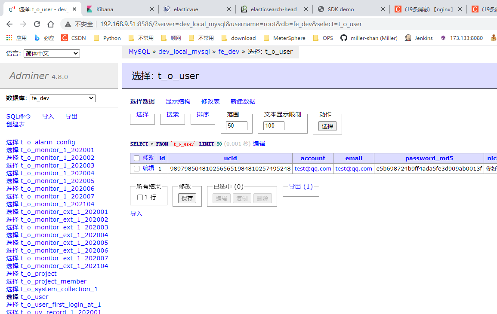

# Fee（灯塔）前端监控系统
## 系统介绍
-   官网：https://github.com/LianjiaTech/fee
-   文档：https://aa978563552.github.io/FEE-doc/zh/arms/1.0/

## 环境搭建
### 系统环境
-   CentOS 7
-   JDK 11：yum install java-11-openjdk-devel -y 
### 安装 Redis-4.0、Memcache-1.5、MongoDB-4.0、Adminer-latest、MySQL-5.7
1. mkdir -p ~/www/fee-docker
2. cd ~/www/fee-docker/
3. git clone https://github.com/alphawq/Fee-dev-docker.git ~/www/fee-docker
4. 修改 docker-compose.yml 文件
```yuml
###############################################################################
#                         Author: alphawq@foxmail.com                         #
###############################################################################
version: '3.1'
services:
  dev_local_memcached:
    image: memcached:1.5-alpine
    container_name: dev_local_memcached_container
    volumes:
      # 配置时区
      - ./base/usr/share/zoneinfo/Asia/Shanghai:/etc/localtime
    ports:
      - '11211:11211'
  dev_local_redis:
    image: redis:4.0-alpine
    #image: redis:alpine
    container_name: dev_local_redis_container
    volumes:
      - ./base/etc/redis:/etc/redis
      - ./log/redis:/var/log/redis
      - ./base/var/lib/redis:/var/lib/redis
      - ./base/usr/share/zoneinfo/Asia/Shanghai:/etc/localtime
    command: ['redis-server', '/etc/redis/redis.conf']
    ports:
      - '6379:6379'
  dev_local_mongo:
    image: mongo:4.0-xenial
    container_name: dev_local_mongo_container
    volumes:
      - ./base/usr/share/zoneinfo/Asia/Shanghai:/etc/localtime
    ports:
      - '27017:27017'
  dev_local_mysql_adminer:
    image: adminer
    container_name: dev_local_adminer_container
    restart: always
    ports:
      - 8080:8586
  dev_local_mysql:
    image: mysql:5.7
    container_name: dev_local_mysql_container
    volumes:
      - ./base/usr/share/zoneinfo/Asia/Shanghai:/etc/localtime
      - ./base/etc/mysql/conf.d:/etc/mysql/conf.d
    # 强行指定编码
    command:
      [
        'mysqld',
        '--character-set-server=utf8mb4',
        '--collation-server=utf8mb4_general_ci',
      ]
    environment:
      MYSQL_ROOT_PASSWORD: 123456
      # MYSQL_USER: 'root'
      MYSQL_PASSWORD: '123456'
      MYSQL_DATABASE: 'fe_dev'
    ports:
      - '3306:3306'
  dev_local_elasticsearch:
    image: elasticsearch:6.6.2
    #image: docker.elastic.co/elasticsearch/elasticsearch:6.6.1    
    container_name: dev_local_elasticsearch_container
    environment:
      - cluster.name=docker-cluster
      - bootstrap.memory_lock=true
      - 'ES_JAVA_OPTS=-Xms512m -Xmx512m'
      - discovery.zen.minimum_master_nodes=2
    ulimits:
      memlock:
        soft: -1
        hard: -1
    volumes:
      - ./data/esdata1:/usr/share/elasticsearch/data
      - ./base/etc/elasticsearch/config/elasticsearch.yml:/usr/share/elasticsearch/config/elasticsearch.yml
    ports:
      - '9200:9200'
  dev_local_elasticsearch2:
    image: elasticsearch:6.6.2
    #image: docker.elastic.co/elasticsearch/elasticsearch:6.6.1
    container_name: dev_local_elasticsearch2_container
    environment:
      - cluster.name=docker-cluster
      - bootstrap.memory_lock=true
      - 'ES_JAVA_OPTS=-Xms512m -Xmx512m'
      - discovery.zen.minimum_master_nodes=2
      - 'discovery.zen.ping.unicast.hosts=dev_local_elasticsearch_container'
    ulimits:
      memlock:
        soft: -1
        hard: -1
    volumes:
      - ./data/esdata2:/usr/share/elasticsearch/data
      - ./base/etc/elasticsearch/config/elasticsearch.yml:/usr/share/elasticsearch/config/elasticsearch.yml
  dev_local_kibana:
    image: docker.elastic.co/kibana/kibana:6.6.2
    #image: docker.elastic.co/kibana/kibana:6.6.1
    container_name: dev_local_kibana_container
    environment:
      # 这个hosts的配置必须要跟ES的container_name相同才能访问
      ELASTICSEARCH_HOSTS: http://dev_local_elasticsearch_container
    ports:
      - '5601:5601'

```

5.  修改Redis配置，去掉日志输出路径，避免启动的时候报没有权限错误。

    ```shell
    vim ~/www/fee-docker/base/etc/redis/redis.conf
    # 注释掉日志输出位置
    #logfile /var/log/redis/redis-server.log
    ```

6.  给data目录添加权限

    ```shell
    cd ~/www/fee-docker/data
    chmod 777 *
    ```

7.  构建并启动服务

    -   debug方式启动：

        ```shell
        cd ~/www/fee-docker
        docker-compose build
        docker-compose up
        ```

    -   服务方式启动: docker-compose -f ~/www/fee-docker/docker-compose.yml up -d

8.  配置MySQL

    -   链接数据库，在数据库中创建一个空的名字叫做"fe_dev"的库.

    -   在`vim ~/www/fee/server/src/configs/mysql.js`中修改主机地址/数据库端口/数据库用户名/数据库密码/数据库库名

        ```mysql.js
        // 开发环境配置
        const development = {
          /* nomal */
          host: '127.0.0.1',
          port: '3306',
          user: 'root',
          password: '123456',
          database: 'fe_dev'
        }
        
        ```

9.  配置Redis.

    -   vim ~/www/fee/server/src/configs/redis.js

    ```
    // 开发环境配置
    const development = {
      host: '127.0.0.1',
      port: '6379'
    }
    
    ```

### 安装项目的 Server、Client

1.  安装依赖，在项目server目录下

```
npm install
```

2.  编译server，打开一个新的终端在项目server目录下

```
npm run watch
```

3.  启动server服务，在项目server目录下

```
npm run dev
```

4.  创建数据库

-   在项目server目录下执行下列指令，会在当前目录下生成init.sql文件

```shell
npm run fee Utils:GenerateSQL 1 '2020-01' '2020-07' > init.sql
```

-   复制 `init.sql`中的内容（**不包括文件中的前两行**），去数据中执行SQL，完成数据库表的创建。

5.  初始化样例数据。在项目 `server` 目录下，执行下列指令

```
npm run fee Utils:TemplateSQL
```

执行成功后，样例数据会被写入数据库中。

6.  安装 `Client` 依赖，在项目 `client` 目录下

```
npm install
```

7.  启动 `Client` 服务，在项目 `client` 目录下。

```
npm run dev
```

8.  访问本地服务: `127.0.0.1:8080`
    -   使用默认管理员账户登录
    -    账号：[test@qq.com](mailto:test@qq.com)
    -   密码：admin

9.  验证环境：

    1.  数据库查看服务（并没有什么用）：http://192.168.9.51:8586/?server=dev_local_mysql&username=root&db=fe_dev&select=t_o_user

        

    2.  kibana：http://192.168.9.51:5601/app/kibana#/management

        

    3.  ES（chrome插件）：chrome-extension://hkedbapjpblbodpgbajblpnlpenaebaa/index.html#/

        

    4.  Elasticsearch：chrome-extension://ffmkiejjmecolpfloofpjologoblkegm/elasticsearch-head/index.html

    

    5.  

### 打点服务搭建

-   整体流程
-   

### Nginx 安装配置

1.  安装nginx参考文档：[InstallNginx](https://github.com/miller-shan/notes/blob/master/Technology/Liunx/CentOS7Notes.md#install-nginx)

2.  配置nginx,主要3个地方：

    -   利用nginx自带的empty_gif模块，配置一个空gif服务
    -   配置日志格式log_format
    -   配置日志存放路径access_log
    -   打开nginx配置文件：vim /etc/nginx/nginx.conf

    ```conf
    # /etc/nginx/nginx.conf
    user root;
    worker_processes  1;
    
    error_log /var/log/nginx/error.log warn;
    pid       /var/run/nginx.pid;
    
    events {
        worker_connections  1024;
    }
    
    http {
        include       /etc/nginx/mime.types;
        default_type  application/octet-stream;
    
        log_format ferms '$time_iso8601     -       -       $remote_addr    $http_host      $status $request_time   $request_length $body_bytes_sent        15d04347-be16-b9ab-0029-24e4b6645950   -       -       9689c3ea-5155-2df7-a719-e90d2dedeb2c 937ba755-116a-18e6-0735-312cba23b00c       -       -       $request_uri    -       $http_user_agent        -       sample=-&_UC_agent=-&device_id=-&-      -       -       -';
    
        access_log  /var/log/nginx/access.log  ferms;
    
        sendfile           on;
        keepalive_timeout  65;
        include /etc/nginx/conf.d/*.conf;
    
        server {
            listen 80;
            #server_name dig-server;
            server_name 192.168.9.51;
    
            if ($time_iso8601 ~ "^(\d{4})-(\d{2})-(\d{2})T(\d{2}):(\d{2})") {
                set $year $1;
                set $month $2;
                set $day $3;
                set $hour $4;
                set $minute $5;
            }
            access_log /var/log/nginx/ferms/$year$month-$day-$hour-$minute.log ferms;
    
            index index.htm index.html;
            root /etc/nginx/html;
    
            location = /dig.gif {
                empty_gif;
            }
        }
    }
    ```

3.  创建html

```
mkdir -p /etc/nginx/html
vi /etc/nginx/html/index.html
<html><body>nginx</body></html>
```

4.  日志存放路径：

    ```shell
    mkdir -p /var/log/nginx/ferms
    ```

5.  创建定时任务删除多余日志

    ```shell
    mkdir -p /root/shell
    cd /root/shell
    vi delete_nginx_logs.sh
    #!/bin/bash
    #Filename: delete_nginx_logs.sh
    LOGS_PATH=/var/log/nginx
    KEEP_DAYS=30
    PID_FILE=/run/nginx.pid
    YESTERDAY=$(date -d "yesterday" +%Y-%m-%d)
    if [ -f $PID_FILE ];then
        echo `date "+%Y-%m-%d %H:%M:%S"` Deleting logs...
        mv ${LOGS_PATH}/access.log ${LOGS_PATH}/access.${YESTERDAY}.log >/dev/null 2>&1
        mv ${LOGS_PATH}/access.json ${LOGS_PATH}/access.${YESTERDAY}.json >/dev/null 2>&1
        mv ${LOGS_PATH}/error.log ${LOGS_PATH}/error.${YESTERDAY}.log >/dev/null 2>&1
        kill -USR1 `cat $PID_FILE`
        echo `date "+%Y-%m-%d %H:%M:%S"` Logs have deleted.
    else
        echo `date "+%Y-%m-%d %H:%M:%S"` Please make sure that nginx is running...
    fi
    echo
    
    find $LOGS_PATH -type f -mtime +$KEEP_DAYS -print0 |xargs -0 rm -f
    ```

6.  使用系统自动的定时任务进行每天自动删除日志

    ```shell
    crontab -e
    # 每天00点00分删除日志文件
    00 00 * * * /bin/bash /root/shell/cut_nginx_logs.sh >>/root/shell/cut_nginx_logs.log 2>&1
    ```

7.  关闭安全模式: setenforce 0

8.  启动服务：

    ```shell
    systemctl start nginx.service
    systemctl enable nginx.service
    ```

9.  查看nginx服务是否启动： ps -e  | grep nginx 
10.  访问nginx：http://192.168.9.51/dig.gif?a=1
11.  查看日志：tail -f /var/log/nginx/ferms/*.log

### SDK测试

1.  修改sdk下打点服务器地址：

```
vim ~/www/fee/sdk/src/index.js

const feeTarget = 'http://192.168.9.51/dig.gif' // 打点服务器，或Nginx地址
```

2.  在sdk目录下build一下

```
cd fee/sdk
npm i --registry=https://registry.npm.taobao.org
npm run build
```

3.  完毕后把build的sdk弄出来, 写个模拟项目，访问后会发送打点给nginx

```shell
cd ~/www/fee/sdk/dist/js/1.0.40/5f8413b/
scp index.js /etc/nginx/html/
cd /etc/nginx/html/
vim testFee.html
<!DOCTYPE html>
<html lang="en">
	<head>
		<meta charset="UTF-8" />
		<meta name="viewport" content="width=device-width, initial-scale=1.0" />
		<title>SDK demo</title>
	</head>

	<body>
		<div id="test">测试SDK</div>
		<script src="./index.js"></script>
		<script>
			// 模拟uuid
			if (!localStorage.getItem("custom_UUID")) {
				const customUUID = Math.random().toString().slice(-6);
				localStorage.setItem("custom_UUID", customUUID);
			}
			window.dt &&
				dt.set({
					pid: "project_test_id", // [必填]项目id, 由灯塔项目组统一分配
					uuid: localStorage.getItem("custom_UUID") || "", // [可选]设备唯一id, 用于计算uv数&设备分布. 一般在cookie中可以取到, 没有uuid可用设备mac/idfa/imei替代. 或者在storage的key中存入随机数字, 模拟设备唯一id.
					ucid: "", // [可选]用户ucid, 用于发生异常时追踪用户信息, 一般在cookie中可以取到, 没有可传空字符串

					is_test: false, // 是否为测试数据, 默认为false(测试模式下打点数据仅供浏览, 不会展示在系统中)
					record: {
						time_on_page: true, // 是否监控用户在线时长数据, 默认为true
						performance: true, // 是否监控页面载入性能, 默认为true
						js_error: true, //  是否监控页面报错信息, 默认为true
						// 配置需要监控的页面报错类别, 仅在js_error为true时生效, 默认均为true(可以将配置改为false, 以屏蔽不需要上报的错误类别)
						js_error_report_config: {
							ERROR_RUNTIME: true, // js运行时报错
							ERROR_SCRIPT: true, // js资源加载失败
							ERROR_STYLE: true, // css资源加载失败
							ERROR_IMAGE: true, // 图片资源加载失败
							ERROR_AUDIO: true, // 音频资源加载失败
							ERROR_VIDEO: true, // 视频资源加载失败
							ERROR_CONSOLE: true, // vue运行时报错
							ERROR_TRY_CATCH: true, // 未catch错误
							// 自定义检测函数, 上报前最后判断是否需要报告该错误
							// 回调函数说明
							// 传入参数 =>
							//            desc:  字符串, 错误描述
							//            stack: 字符串, 错误堆栈信息
							// 返回值 =>
							//            true  : 上报打点请求
							//            false : 不需要上报
							checkErrrorNeedReport: function (desc, stack) {
								return true;
							},
						},
					},

					// 业务方的js版本号, 会随着打点数据一起上传, 方便区分数据来源
					// 可以不填, 默认为1.0.0
					version: "1.0.0",

					// 对于如同
					// test.com/detail/1.html
					// test.com/detail/2.html
					// test.com/detail/3.html
					// ...
					// 这种页面来说, 虽然url不同, 但他们本质上是同一个页面
					// 因此需要业务方传入一个处理函数, 根据当前url解析出真实的页面类型(例如: 二手房列表/经纪人详情页), 以便灯塔系统对错误来源进行分类
					// 回调函数说明
					// 传入参数 => window.location
					// 返回值 => 对应的的页面类型(50字以内, 建议返回汉字, 方便查看), 默认是返回当前页面的url
					getPageType: function (location) {
						return `${location.host}${location.pathname}`;
					},
				});

			// 通过点击手动创建错误
			const testDOM = document.getElementById("test");
			testDOM.addEventListener("click", function () {
				console.log(window.a.b);
			});
		</script>
	</body>
</html>
```

### 安装Zookeeper、Kafka

1.  参考文档：[Zookeeper and KafKa install](https://github.com/miller-shan/notes/blob/master/Technology/Liunx/CentOS7Notes.md#zookeeper-and-kafka-install)

2.  Kafka配置文件添加监听的IP（由于我修改了Zookepper端口，所以这里我将Zookeeper端口也修改为2182）：vim /usr/local/kafka/kafka_2.13-2.7.0/config/server.properties

    ```properties
    # Licensed to the Apache Software Foundation (ASF) under one or more
    # contributor license agreements.  See the NOTICE file distributed with
    # this work for additional information regarding copyright ownership.
    # The ASF licenses this file to You under the Apache License, Version 2.0
    # (the "License"); you may not use this file except in compliance with
    # the License.  You may obtain a copy of the License at
    #
    #    http://www.apache.org/licenses/LICENSE-2.0
    #
    # Unless required by applicable law or agreed to in writing, software
    # distributed under the License is distributed on an "AS IS" BASIS,
    # WITHOUT WARRANTIES OR CONDITIONS OF ANY KIND, either express or implied.
    # See the License for the specific language governing permissions and
    # limitations under the License.
    
    # see kafka.server.KafkaConfig for additional details and defaults
    
    ############################# Server Basics #############################
    
    # The id of the broker. This must be set to a unique integer for each broker.
    broker.id=0
    
    ############################# Socket Server Settings #############################
    
    # The address the socket server listens on. It will get the value returned from 
    # java.net.InetAddress.getCanonicalHostName() if not configured.
    #   FORMAT:
    #     listeners = listener_name://host_name:port
    #   EXAMPLE:
    #     listeners = PLAINTEXT://your.host.name:9092
    #listeners=PLAINTEXT://:9092
    
    listeners=PLAINTEXT://192.168.9.51:9092
    advertised.listeners=PLAINTEXT://192.168.9.51:9092
    
    # Hostname and port the broker will advertise to producers and consumers. If not set, 
    # it uses the value for "listeners" if configured.  Otherwise, it will use the value
    # returned from java.net.InetAddress.getCanonicalHostName().
    #advertised.listeners=PLAINTEXT://your.host.name:9092
    
    # Maps listener names to security protocols, the default is for them to be the same. See the config documentation for more details
    #listener.security.protocol.map=PLAINTEXT:PLAINTEXT,SSL:SSL,SASL_PLAINTEXT:SASL_PLAINTEXT,SASL_SSL:SASL_SSL
    
    # The number of threads that the server uses for receiving requests from the network and sending responses to the network
    num.network.threads=3
    
    # The number of threads that the server uses for processing requests, which may include disk I/O
    num.io.threads=8
    
    # The send buffer (SO_SNDBUF) used by the socket server
    socket.send.buffer.bytes=102400
    
    # The receive buffer (SO_RCVBUF) used by the socket server
    socket.receive.buffer.bytes=102400
    
    # The maximum size of a request that the socket server will accept (protection against OOM)
    socket.request.max.bytes=104857600
    
    
    ############################# Log Basics #############################
    
    # A comma separated list of directories under which to store log files
    log.dirs=/tmp/kafka-logs
    
    # The default number of log partitions per topic. More partitions allow greater
    # parallelism for consumption, but this will also result in more files across
    # the brokers.
    num.partitions=1
    
    # The number of threads per data directory to be used for log recovery at startup and flushing at shutdown.
    # This value is recommended to be increased for installations with data dirs located in RAID array.
    num.recovery.threads.per.data.dir=1
    
    ############################# Internal Topic Settings  #############################
    # The replication factor for the group metadata internal topics "__consumer_offsets" and "__transaction_state"
    # For anything other than development testing, a value greater than 1 is recommended to ensure availability such as 3.
    offsets.topic.replication.factor=1
    transaction.state.log.replication.factor=1
    transaction.state.log.min.isr=1
    
    ############################# Log Flush Policy #############################
    
    # Messages are immediately written to the filesystem but by default we only fsync() to sync
    # the OS cache lazily. The following configurations control the flush of data to disk.
    # There are a few important trade-offs here:
    #    1. Durability: Unflushed data may be lost if you are not using replication.
    #    2. Latency: Very large flush intervals may lead to latency spikes when the flush does occur as there will be a lot of data to flush.
    #    3. Throughput: The flush is generally the most expensive operation, and a small flush interval may lead to excessive seeks.
    # The settings below allow one to configure the flush policy to flush data after a period of time or
    # every N messages (or both). This can be done globally and overridden on a per-topic basis.
    
    # The number of messages to accept before forcing a flush of data to disk
    #log.flush.interval.messages=10000
    
    # The maximum amount of time a message can sit in a log before we force a flush
    #log.flush.interval.ms=1000
    
    ############################# Log Retention Policy #############################
    
    # The following configurations control the disposal of log segments. The policy can
    # be set to delete segments after a period of time, or after a given size has accumulated.
    # A segment will be deleted whenever *either* of these criteria are met. Deletion always happens
    # from the end of the log.
    
    # The minimum age of a log file to be eligible for deletion due to age
    log.retention.hours=168
    
    # A size-based retention policy for logs. Segments are pruned from the log unless the remaining
    # segments drop below log.retention.bytes. Functions independently of log.retention.hours.
    #log.retention.bytes=1073741824
    
    # The maximum size of a log segment file. When this size is reached a new log segment will be created.
    log.segment.bytes=1073741824
    
    # The interval at which log segments are checked to see if they can be deleted according
    # to the retention policies
    log.retention.check.interval.ms=300000
    
    ############################# Zookeeper #############################
    
    # Zookeeper connection string (see zookeeper docs for details).
    # This is a comma separated host:port pairs, each corresponding to a zk
    # server. e.g. "127.0.0.1:3000,127.0.0.1:3001,127.0.0.1:3002".
    # You can also append an optional chroot string to the urls to specify the
    # root directory for all kafka znodes.
    zookeeper.connect=localhost:2182
    
    # Timeout in ms for connecting to zookeeper
    zookeeper.connection.timeout.ms=18000
    
    
    ############################# Group Coordinator Settings #############################
    
    # The following configuration specifies the time, in milliseconds, that the GroupCoordinator will delay the initial consumer rebalance.
    # The rebalance will be further delayed by the value of group.initial.rebalance.delay.ms as new members join the group, up to a maximum of max.poll.interval.ms.
    # The default value for this is 3 seconds.
    # We override this to 0 here as it makes for a better out-of-the-box experience for development and testing.
    # However, in production environments the default value of 3 seconds is more suitable as this will help to avoid unnecessary, and potentially expensive, rebalances during application startup.
    group.initial.rebalance.delay.ms=0
    
    ```

    3.  开启Kafka服务

    ```shell
    cd /usr/local/kafka/kafka_2.13-2.7.0/
    bin/kafka-server-start.sh config/server.properties
    
    ```

    4.  开始消费

        ```shell
        ./kafka-console-consumer.sh --bootstrap-server 192.168.9.51:9092 --topic fee --from-beginning
        ```

    5.  开始生产。新开一个窗口

        ```shell
        ./kafka-console-producer.sh --broker-list 192.168.9.51:9092 --topic fee
        ```

### 安装Kafka Manage 

-   参考文档:[KafkaMangerInstall](https://github.com/miller-shan/notes/blob/master/Technology/Liunx/CentOS7Notes.md#kafka-manager-install)

### Filebeat install

1.  Filebeat会作为producer将nginx产生的日志作为消息发送到kafka
2.  下载: sudo rpm --import https://packages.elastic.co/GPG-KEY-elasticsearch
3.  在/etc/yum.repos.d/目录下，创建一个elastic.repo文件，并且添加以下行

```
[elastic-7.x]
name=Elastic repository for 7.x packages
baseurl=https://artifacts.elastic.co/packages/7.x/yum
gpgcheck=1
gpgkey=https://artifacts.elastic.co/GPG-KEY-elasticsearch
enabled=1
autorefresh=1
type=rpm-md
```

4.  安装：sudo yum install filebeat -y

5.  修改IP和日志路径配置：vim /etc/filebeat/filebeat.yml

    ```yml
    ###################### Filebeat Configuration Example #########################
    
    # This file is an example configuration file highlighting only the most common
    # options. The filebeat.reference.yml file from the same directory contains all the
    # supported options with more comments. You can use it as a reference.
    #
    # You can find the full configuration reference here:
    # https://www.elastic.co/guide/en/beats/filebeat/index.html
    
    # For more available modules and options, please see the filebeat.reference.yml sample
    # configuration file.
    
    # ============================== Filebeat inputs ===============================
    
    filebeat.inputs:
    
    # Each - is an input. Most options can be set at the input level, so
    # you can use different inputs for various configurations.
    # Below are the input specific configurations.
    
    - type: log
    
      # Change to true to enable this input configuration.
      enabled: true
    
      # Paths that should be crawled and fetched. Glob based paths.
      paths:
        - /var/log/nginx/ferms/*.log
        #- c:\programdata\elasticsearch\logs\*
    
      # Exclude lines. A list of regular expressions to match. It drops the lines that are
      # matching any regular expression from the list.
      #exclude_lines: ['^DBG']
    
      # Include lines. A list of regular expressions to match. It exports the lines that are
      # matching any regular expression from the list.
      #include_lines: ['^ERR', '^WARN']
    
      # Exclude files. A list of regular expressions to match. Filebeat drops the files that
      # are matching any regular expression from the list. By default, no files are dropped.
      #exclude_files: ['.gz$']
    
      # Optional additional fields. These fields can be freely picked
      # to add additional information to the crawled log files for filtering
      #fields:
      #  level: debug
      #  review: 1
    
      ### Multiline options
    
      # Multiline can be used for log messages spanning multiple lines. This is common
      # for Java Stack Traces or C-Line Continuation
    
      # The regexp Pattern that has to be matched. The example pattern matches all lines starting with [
      #multiline.pattern: ^\[
    
      # Defines if the pattern set under pattern should be negated or not. Default is false.
      #multiline.negate: false
    
      # Match can be set to "after" or "before". It is used to define if lines should be append to a pattern
      # that was (not) matched before or after or as long as a pattern is not matched based on negate.
      # Note: After is the equivalent to previous and before is the equivalent to to next in Logstash
      #multiline.match: after
    
    # ============================== Filebeat modules ==============================
    
    filebeat.config.modules:
      # Glob pattern for configuration loading
      path: ${path.config}/modules.d/*.yml
    
      # Set to true to enable config reloading
      reload.enabled: false
    
      # Period on which files under path should be checked for changes
      #reload.period: 10s
    
    # ======================= Elasticsearch template setting =======================
    
    setup.template.settings:
      index.number_of_shards: 3
      #index.codec: best_compression
      #_source.enabled: false
    
    
    # ================================== General ===================================
    
    # The name of the shipper that publishes the network data. It can be used to group
    # all the transactions sent by a single shipper in the web interface.
    #name:
    
    # The tags of the shipper are included in their own field with each
    # transaction published.
    #tags: ["service-X", "web-tier"]
    
    # Optional fields that you can specify to add additional information to the
    # output.
    #fields:
    #  env: staging
    
    # ================================= Dashboards =================================
    # These settings control loading the sample dashboards to the Kibana index. Loading
    # the dashboards is disabled by default and can be enabled either by setting the
    # options here or by using the `setup` command.
    #setup.dashboards.enabled: false
    
    # The URL from where to download the dashboards archive. By default this URL
    # has a value which is computed based on the Beat name and version. For released
    # versions, this URL points to the dashboard archive on the artifacts.elastic.co
    # website.
    #setup.dashboards.url:
    
    # =================================== Kibana ===================================
    
    # Starting with Beats version 6.0.0, the dashboards are loaded via the Kibana API.
    # This requires a Kibana endpoint configuration.
    setup.kibana:
    
      # Kibana Host
      # Scheme and port can be left out and will be set to the default (http and 5601)
      # In case you specify and additional path, the scheme is required: http://localhost:5601/path
      # IPv6 addresses should always be defined as: https://[2001:db8::1]:5601
      #host: "localhost:5601"
    
      # Kibana Space ID
      # ID of the Kibana Space into which the dashboards should be loaded. By default,
      # the Default Space will be used.
      #space.id:
    
    # =============================== Elastic Cloud ================================
    
    # These settings simplify using Filebeat with the Elastic Cloud (https://cloud.elastic.co/).
    
    # The cloud.id setting overwrites the `output.elasticsearch.hosts` and
    # `setup.kibana.host` options.
    # You can find the `cloud.id` in the Elastic Cloud web UI.
    #cloud.id:
    
    # The cloud.auth setting overwrites the `output.elasticsearch.username` and
    # `output.elasticsearch.password` settings. The format is `<user>:<pass>`.
    #cloud.auth:
    
    # ================================== Outputs ===================================
    
    # Configure what output to use when sending the data collected by the beat.
    
    # ---------------------------- Elasticsearch Output ----------------------------
    #output.elasticsearch:
      # Array of hosts to connect to.
      hosts: ["localhost:9200"]
    
      # Protocol - either `http` (default) or `https`.
      #protocol: "https"
    
      # Authentication credentials - either API key or username/password.
      #api_key: "id:api_key"
      #username: "elastic"
      #password: "changeme"
    
    # ------------------------------ Logstash Output -------------------------------
    #output.logstash:
      # The Logstash hosts
      #hosts: ["localhost:5044"]
    
      # Optional SSL. By default is off.
      # List of root certificates for HTTPS server verifications
      #ssl.certificate_authorities: ["/etc/pki/root/ca.pem"]
    
      # Certificate for SSL client authentication
      #ssl.certificate: "/etc/pki/client/cert.pem"
    
      # Client Certificate Key
      #ssl.key: "/etc/pki/client/cert.key"
    
    
    # ================================== Logging ===================================
    
    # Sets log level. The default log level is info.
    # Available log levels are: error, warning, info, debug
    logging.level: debug
    
    # At debug level, you can selectively enable logging only for some components.
    # To enable all selectors use ["*"]. Examples of other selectors are "beat",
    # "publish", "service".
    #logging.selectors: ["*"]
    
    # ================================== Outputs ===================================
    
    output.kafka:
      hosts: ["192.168.9.51:9092", "xxx.xxx.xxx.xxx:9092","yyy.yyy.yyy.yyy:9092","zzz.zzz.zzz.zzz:9092"]
      topic: "fee"
    
    
    # ============================= X-Pack Monitoring ==============================
    # Filebeat can export internal metrics to a central Elasticsearch monitoring
    # cluster.  This requires xpack monitoring to be enabled in Elasticsearch.  The
    # reporting is disabled by default.
    
    # Set to true to enable the monitoring reporter.
    #monitoring.enabled: false
    
    # Sets the UUID of the Elasticsearch cluster under which monitoring data for this
    # Filebeat instance will appear in the Stack Monitoring UI. If output.elasticsearch
    # is enabled, the UUID is derived from the Elasticsearch cluster referenced by output.elasticsearch.
    #monitoring.cluster_uuid:
    
    # Uncomment to send the metrics to Elasticsearch. Most settings from the
    # Elasticsearch output are accepted here as well.
    # Note that the settings should point to your Elasticsearch *monitoring* cluster.
    # Any setting that is not set is automatically inherited from the Elasticsearch
    # output configuration, so if you have the Elasticsearch output configured such
    # that it is pointing to your Elasticsearch monitoring cluster, you can simply
    # uncomment the following line.
    #monitoring.elasticsearch:
    
    # ============================== Instrumentation ===============================
    
    # Instrumentation support for the filebeat.
    #instrumentation:
        # Set to true to enable instrumentation of filebeat.
        #enabled: false
    
        # Environment in which filebeat is running on (eg: staging, production, etc.)
        #environment: ""
    
        # APM Server hosts to report instrumentation results to.
        #hosts:
        #  - http://localhost:8200
    
        # API Key for the APM Server(s).
        # If api_key is set then secret_token will be ignored.
        #api_key:
    
        # Secret token for the APM Server(s).
        #secret_token:
    
    
    # ================================= Processors =================================
    processors:
      - drop_fields:
          fields: ["@timestamp", "@metadata", "log", "input", "ecs", "host", "agent"]
    
    
    # ================================= Migration ==================================
    
    # This allows to enable 6.7 migration aliases
    #migration.6_to_7.enabled: true
    
    ```

    6.  启动服务

        ```shell
        # 启动
        systemctl start filebeat.service
        # 开机启动
        systemctl enable filebeat.service
        # 状态
        systemctl status filebeat.service
        # 停止
        systemctl stop filebeat.service
        ```

    7.  会收到filebeat生产的文件，此时访问上面fee里写的网页，触发发送给打点服务器产生日志，filebeat生产消息，kafka拿到消息给消费者，这部分就完成了。


### rsyslog相关
>    rsyslog对 kafka的支持是v8.7.0版本后才提供的支持
>
>    1.  运行下列命令:
```
yum install rsyslog
yum install rsyslog-kafka.x86_64
```
安装完成后查看 `/lib64/rysylog/)` 中是否存在 `omkafka.so` ,验证 `rsyslog-kafka` 是否安装成功

2. rsyslog配置,编辑配置文件vim /etc/rsyslog.conf，在配置文件 `#### MODULES ####` 的下面添加如下配置

```conf
# rsyslog configuration file

# For more information see /usr/share/doc/rsyslog-*/rsyslog_conf.html
# If you experience problems, see http://www.rsyslog.com/doc/troubleshoot.html

#### MODULES ####
module(load="omkafka")
module(load="imfile")
# nginx template
template(name="nginxAccessTemplate" type="string" string="%hostname%<-+>%syslogtag%<-+>%msg%\n")
# ruleset
ruleset(name="nginx-kafka") {
     #日志转发kafka
    action (
        type="omkafka"
	    template="nginxAccessTemplate"
        topic="fee"
        broker="localhost:9092"
    )
}
# 定义消息来源及设置相关的action
input(type="imfile" Tag="nginx-accesslog" File="/var/log/nginx/ferms/*.log" Ruleset="nginx-kafka")


# The imjournal module bellow is now used as a message source instead of imuxsock.
$ModLoad imuxsock # provides support for local system logging (e.g. via logger command)
$ModLoad imjournal # provides access to the systemd journal
#$ModLoad imklog # reads kernel messages (the same are read from journald)
#$ModLoad immark  # provides --MARK-- message capability

# Provides UDP syslog reception
#$ModLoad imudp
#$UDPServerRun 514

# Provides TCP syslog reception
#$ModLoad imtcp
#$InputTCPServerRun 514


#### GLOBAL DIRECTIVES ####

# Where to place auxiliary files
$WorkDirectory /var/lib/rsyslog

# Use default timestamp format
$ActionFileDefaultTemplate RSYSLOG_TraditionalFileFormat

# File syncing capability is disabled by default. This feature is usually not required,
# not useful and an extreme performance hit
#$ActionFileEnableSync on

# Include all config files in /etc/rsyslog.d/
$IncludeConfig /etc/rsyslog.d/*.conf

# Turn off message reception via local log socket;
# local messages are retrieved through imjournal now.
$OmitLocalLogging on

# File to store the position in the journal
$IMJournalStateFile imjournal.state


#### RULES ####

# Log all kernel messages to the console.
# Logging much else clutters up the screen.
#kern.*                                                 /dev/console

# Log anything (except mail) of level info or higher.
# Don't log private authentication messages!
*.info;mail.none;authpriv.none;cron.none                /var/log/messages

# The authpriv file has restricted access.
authpriv.*                                              /var/log/secure

# Log all the mail messages in one place.
mail.*                                                  -/var/log/maillog


# Log cron stuff
cron.*                                                  /var/log/cron

# Everybody gets emergency messages
*.emerg                                                 :omusrmsg:*

# Save news errors of level crit and higher in a special file.
uucp,news.crit                                          /var/log/spooler

# Save boot messages also to boot.log
local7.*                                                /var/log/boot.log


# ### begin forwarding rule ###
# The statement between the begin ... end define a SINGLE forwarding
# rule. They belong together, do NOT split them. If you create multiple
# forwarding rules, duplicate the whole block!
# Remote Logging (we use TCP for reliable delivery)
#
# An on-disk queue is created for this action. If the remote host is
# down, messages are spooled to disk and sent when it is up again.
#$ActionQueueFileName fwdRule1 # unique name prefix for spool files
#$ActionQueueMaxDiskSpace 1g   # 1gb space limit (use as much as possible)
#$ActionQueueSaveOnShutdown on # save messages to disk on shutdown
#$ActionQueueType LinkedList   # run asynchronously
#$ActionResumeRetryCount -1    # infinite retries if host is down
# remote host is: name/ip:port, e.g. 192.168.0.1:514, port optional
#*.* @@remote-host:514
# ### end of the forwarding rule ###

```

3.  配置说明
    1.  `localhost:9092` 需要修改为你自己的kafka地址（如果为集群多个地址逗号分隔）
    2.  `/var/log/nginx/ferms/*.log` 是监控的nginx日志文件
    3.  `topic: fee`后续通过 `kafka-manager` 查看

4.  修改完配置后运行： `rsyslogd -N 1` 或者 `rsyslogd -dn` 查看配置是否报错
5.  然后重启 `rsyslog` --`service rsyslog restart` 重启后查看 `/var/log/message` 中日志是否报错。

### 修改项目的kafka配置

1.  修改kafka配置如下：`src/configs/kafka.js`

    ```js
    cd ~/www/fee/server
    vim src/configs/kafka.js
    const production = {
        'group.id':'fee-dig-www-log',
        'metadata.broker.list':'192.168.9.51:9092'
    }
    ```

2.  客户端订阅消息,修改parseKafkaLog.js文件中57行

    ```shell
    cd ~/www/fee/server
    vim src/commands/save_log/parseKafkaLog.js
    
    ```

    ```js
     57     client.on('ready', () => {
     58       client.subscribe(['fee', 'fee-dig-www-log'])
     59       client.consume()
     60       this.log(`[pid:${pid}]kafka 链接成功, 开始录入数据`)
    ```

3.  开启消费任务 `npm run fee SaveLog:Kafka`

4.  Done！