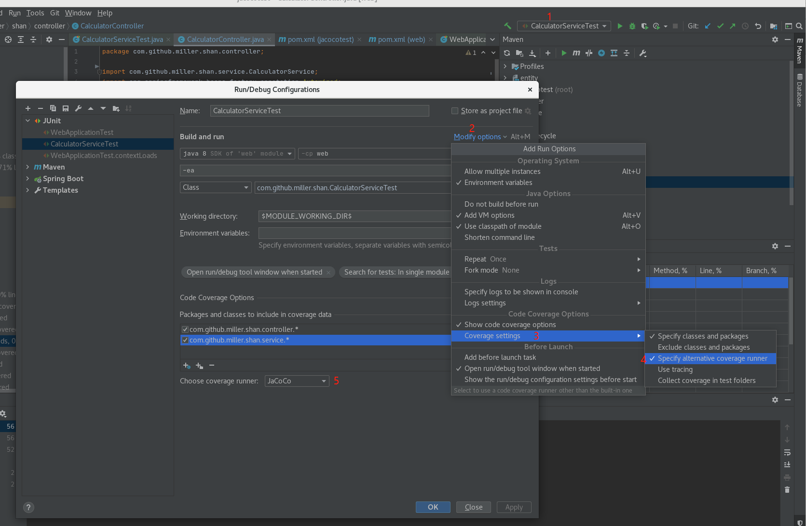

# JaCoCo Introduction

-   官网：https://www.eclemma.org/jacoco/
-   源码：https://github.com/jacoco/jacoco
-   JaCoCo is a free code coverage library for Java, which has been created by the EclEmma team based on the lessons learned from using and integration existing libraries for many years.

## 覆盖率定义

-   作为测试如何通过覆盖率保证产品的质量？通常会将测试覆盖率分为两个部分，即“需求覆盖率”和“代码覆盖率”。
-   指令覆盖：计数单元是单个java二进制代码指令，指令覆盖率提供了代码是否被执行的信息，度量完全 独立源码格式。
-   圈复杂度：在（线性）组合中，计算在一个方法里面所有可能路径的最小数目，缺失的复杂度同样表示测 试案例没有完全覆盖到这个模块。

## 单元测试覆盖率-使用Maven

1. 通过Maven统计单元测试覆盖率，使用jacoco-maven-plugin插件的report-aggregate可以生成每个模块下的测试覆盖率，但是每个moudle的覆盖率是单独统计的没有汇总，除非在依赖中显示声明。举个例子：有个JaCoCoTest工程下面有4个moudle，web->service->mapper->entity,依赖关系为web->service->mapper->entity，这时候使用report-aggregate插件会在各自模块下生成覆盖率统计结果。如何汇总？解决方法：新建一个空的module，比如叫jacoco-report，在这个pom里面手动添加相关依赖web、service、mapper、entity，并且在父模块JaCoCoTest工程目录里面把这个jacoco-report加入到moudles中，这时候在父工程目录下执行mvn clean install 时就会将所有申明的依赖模块全部统计在jacoco-report模块的target目录下。

## FAQ

- IDEA 里如何使用Jacoco进行覆盖率查看

1. Run Configurations-->Modify options-->修改 Coverage settings --> Specify alternative  converage runner--> 选择 JaCoCo。

2.  右键运行的时候选择“More Run/Debug”

## Reference

- Multi Module Spring Boot集成测试使用JaCoCo生成:https://segmentfault.com/a/1190000023722057
- https://www.open-open.com/lib/view/open1472174544246.html
- https://segmentfault.com/a/1190000022259363
-   https://github.com/didi/super-jacoco

