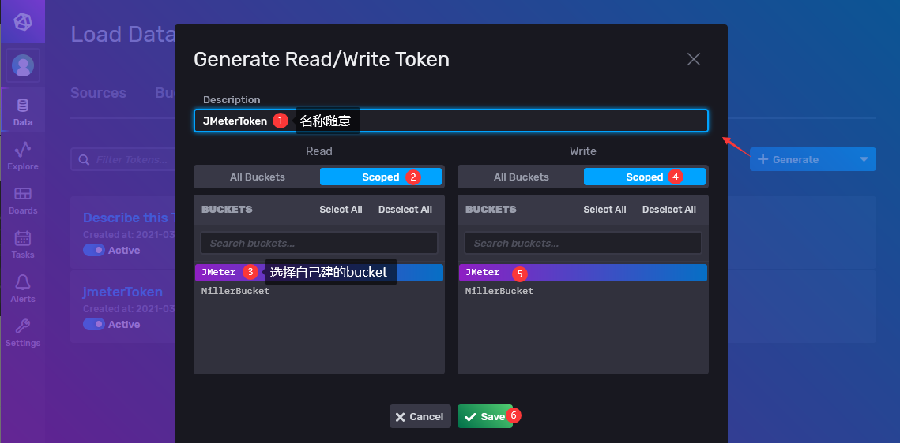
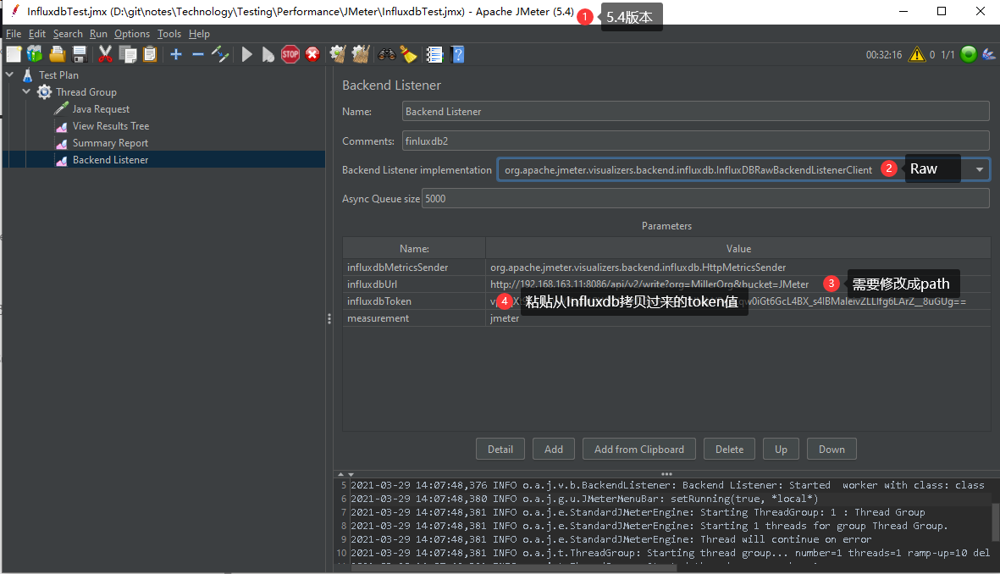
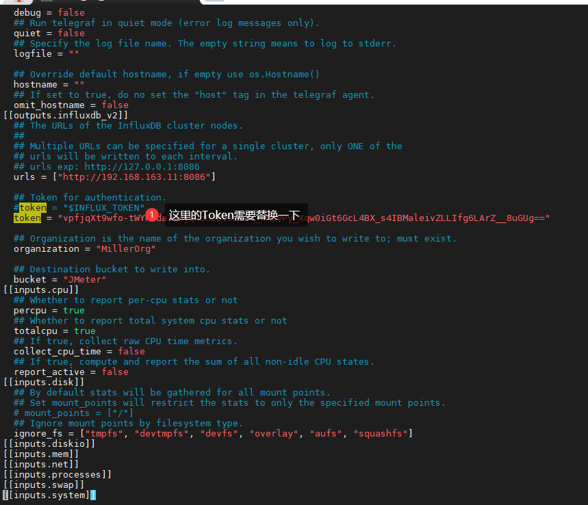

# JMeterIntegrateInfluxdb2

# JMeter Install

1.  建议使用JMeter5.4版本[JMeterDownload](https://jmeter.apache.org/download_jmeter.cgi)。

## Influxdb2 install
- Influxdb 是一个开源的分布式时序、时间和指标数据库，使用 Go 语言编写，无需外部依赖。Influxdb 有如下三大特性：
    - 基于时间序列，支持与时间有关的相关函数（如最大，最小，求和等）；
    - 可度量性：你可以实时对大量数据进行计算；
    - 基于事件：它支持任意的事件数据；

1. 官网下载及安装方法：https://portal.influxdata.com/downloads/ 

    ```
    wget https://dl.influxdata.com/influxdb/releases/influxdb2-2.0.4.x86_64.rpm
    sudo yum localinstall influxdb2-2.0.4.x86_64.rpm
    wget https://dl.influxdata.com/telegraf/releases/telegraf-1.18.0-1.x86_64.rpm
    sudo yum localinstall telegraf-1.18.0-1.x86_64.rpm
    ```

2. github及安装方法：官网如果下载不了从github上下载

    1. https://github.com/influxdata/influxdb/releases/tag/v2.0.3
    2. https://github.com/influxdata/telegraf/releases/tag/v1.18.0

    ```
    wget https://dl.influxdata.com/influxdb/releases/influxdb2-2.0.3.x86_64.rpm
    rpm -iv influxdb2-2.0.3.x86_64.rpm
    wget https://dl.influxdata.com/telegraf/releases/telegraf-1.18.0-1.x86_64.rpm
    rpm -iv telegraf-1.18.0-1.x86_64.rpm
    
    ```

3. 启动服务：sudo service influxdb start

4. 访问：http://192.168.163.11:8086/  第一次初始化需要输入账号、密码、组织、bucket等信息。

5. 如果需要通过CLI（command line interface），[官网](https://docs.influxdata.com/influxdb/v2.0/get-started/)建议我们做一个设置以避免每次都需要进行身份验证。

    ```
     influx config create -n default \
        -u http://192.168.163.11:8086 \
        -o MillerOrg \
        -t ripoNMQhBlscArM7Nr_mGnjroq_dltBUxAqf5eI4zXsSIRion_eu0_f-DYIeZIFQ5Rc5zztVD34FEUNQQETNLQ== \
        -a
    ```

### Influxdb 整合 JMeter

1. JMeter数据写入Influxdb需要在influxdb中生成一个token用于外部系统写入数据库。

2. 在Influxdb中选择 **Data > Tokens**, 点击 **Generate > Read**/**Write Token** .

    

3. 生成之后返回Tokens页面点击“JMeterToken”弹出token页面点击“Copy to Clipboard”复制token。

4. 启动JMeter。在测试计划上添加一个一个线程组-->添加一个Java Request-->添加结果树监听。

5. 添加一个BackendListener用于将JMeter的数据发送给Influxdb，“Thread Gropu --> Add -->Listener-->BackendListener”选择"org.apache.jmeter.visualizers.backend.influxdb.InfluxDB**RawBackendListenerClient**".

    -   influxdbUrl：http://192.168.163.11:8086/api/v2/write?org=MillerOrg&bucket=JMeter

    

    -   注意：如果JMeter是5.4以前的版本可以没有Raw这个监听器，那选择"org.apache.jmeter.visualizers.backend.influxdb.InfluxDBBackendListenerClient".然后添加一个参数Add-->Name：influxdbToken， Value：MyToken。

6. 线程组勾选“Loop Count Infinite”循环发送请求。

    

7. 登入Influxdb查看数据表

    

8. 看到这张图基本上就是完成了环境搭建了。

### Influxdb 使用 Telegraf

-   Telegraf 是一个用 Go 编写的代理程序，可收集系统和服务的统计数据，并写入到 InfluxDB 数据库。内存占用小，通过插件系统可轻松添加支持其他服务的扩展。Telegraf 可以采集多种组件的运行信息，而不需要自己手写脚本定时采集，降低数据获取的难度。

1.  下载安装：略，上面安装Influxdb时已经介绍安装过了。

2.  创建配置文件：左侧菜单Data-->Telegraf-->Create Configuration-->选择一个Bucket-->选择System-->Continue-->

    

3.  创建完会提示让你验证你的配置，直接“Finish”即可。后面再验证。创建完之后会在Tokens页自动创建用于读写telegraf的token。

4.  拷贝配置文件内容

    

5.  备份telegraf.conf并且使用我们刚刚新生成的配置文件, 需要修改配置文件里面的token。logfile可以根据自行选择进行添加路径，目前我设置的是“logfile = "/var/log/telegraf/telegraf.log"。

    ```shell
    [root@perf src]# cd /etc/telegraf/
    [root@perf telegraf]# mv telegraf.conf telegraf.conf.back
    [root@perf telegraf]# vi telegraf.conf
    ```

    

6.   重启服务：service telegraf start  
7.  添加dashboard，从模板中创建。


8.  点击刚刚创建的System模板，添加一条过滤规则，根据主机名进行过滤。（不知道主机名的在命令行敲：hostname）

    

```javascript
from(bucket: v.bucket)
  |> range(start: v.timeRangeStart)
  |> filter(fn: (r) => r._measurement == "system")
  |> filter(fn: (r) => r._field == "uptime")
  |> filter(fn: (r) => r["host"] == "perf这里输入你自己的主机名") 
   |> last()
   |> map(fn: (r) => ({r with _value: r._value / 86400}))
  |> yield(name: "last")
```

9.  到此就完成了主机基本信息的监控了。


## 参考资料

>   https://qainsights.com/jmeter-integration-with-influxdb-2-0/

>   https://blog.csdn.net/qq_29648139/article/details/104071486


