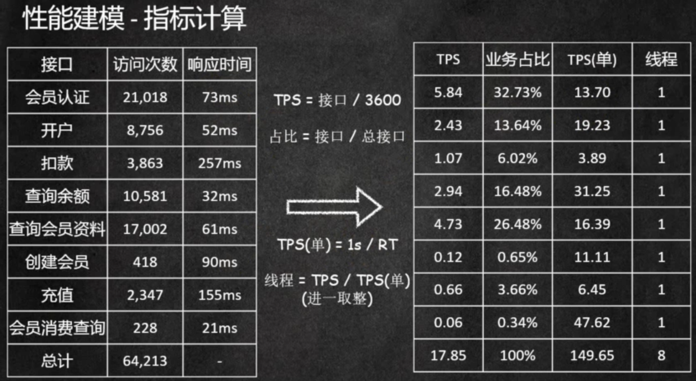

# JMeter性能测试环境搭建

## Influxdb install

1. 下载：官网如果下载不了从github上下载：https://github.com/influxdata/influxdb/releases/tag/v2.0.3
2. 安装：rpm -iv influxdb2-2.0.3.x86_64.rpm
3. 启动服务：systemctl start influxdb
4. 访问：http://192.168.163.11:8086/  第一次初始化需要输入账号、密码、组织等信息。

### Influxdb Guide

1. *特别注意*：influxDB 2.0版本相对1.x版本改动较大，尤其是语法方面的改动，2.0版本的语法使用的是*JavaScript*，1.x使用的是*sql*。

2. 使用 ：https://blog.csdn.net/qq_29648139/article/details/104071486
3. 